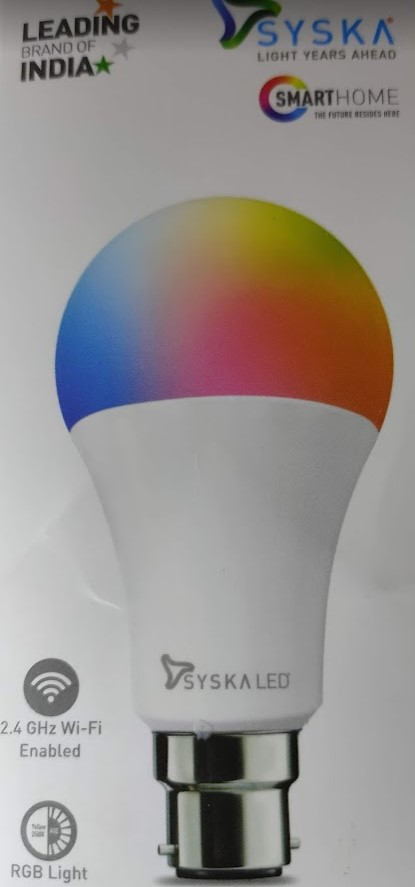
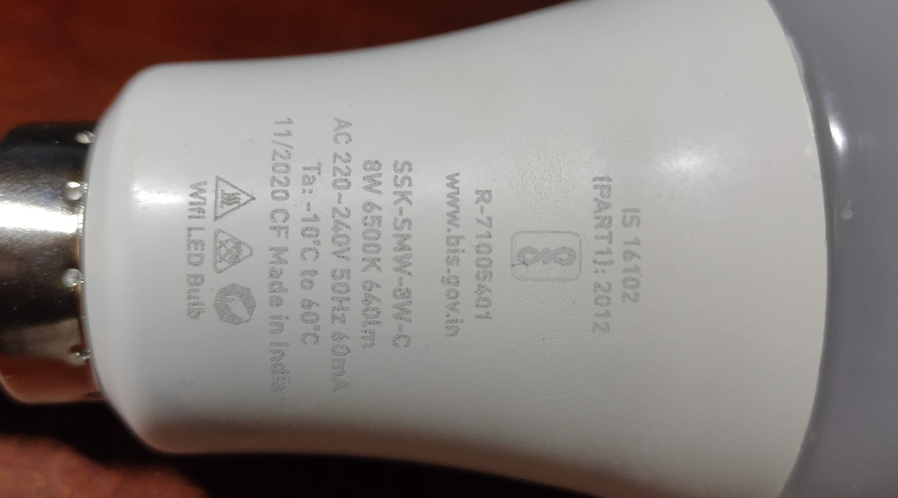
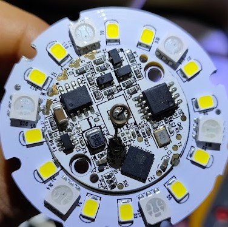
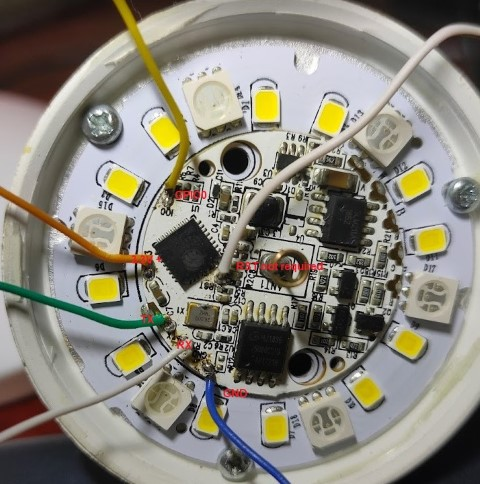

# Syska SSK-SMW-8W-C Wi-Fi Smart Bulb

Syska SSK-SMW-8W-C Wi-Fi Smart Bulb is available on Flipkart/Amazon India and many other online sites.

I was able to get the 8W version for INR 299.

# Instructions on how to connect and Tasmotise

1)  Tap and rotate the diffuser of the LED lamp to open (No need to open the base portion of the bulb)
2)  Solder wires or use pogo pins to conect to USB to serial converter
3)  For some reason, couldn't get to work with CP2102 based USB adapaters, but worked fine with CH340G
4)  Connection - 3.3V and Gnd of USB to serial to respective pins,Tx to Rx and Rx to TX, IO0 was marked for GPIO 0 which should be grounded for programming.
5)  Use Tasmotiser windows executable and use only tasmota.bin or tasmota-lite.bin (tasmota-minimal.bin is a specialised build to subsequently allow OTA uploads. This version should NOT be used for initial installation!)
6)  Template had to be changed and is now updated to the template library.

The template code is given below 
----------

`{"NAME":"Syska SSK-SMW-8W-C","GPIO":[0,0,0,0,420,419,0,0,417,418,416,0,0,0],"FLAG":0,"BASE":18}`

